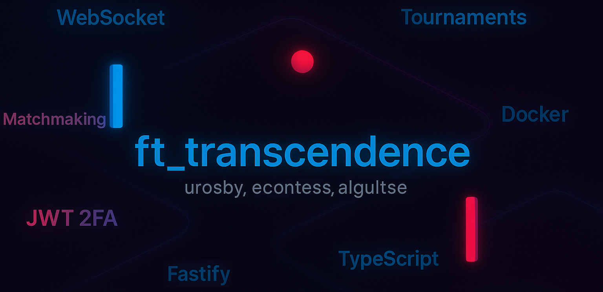
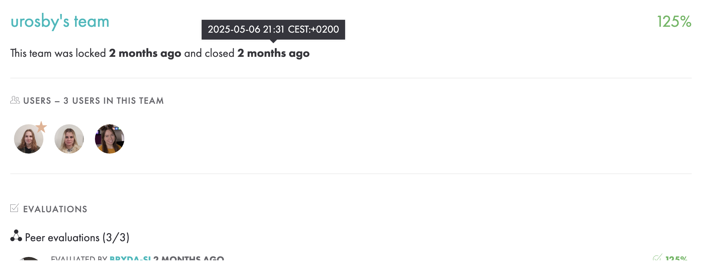
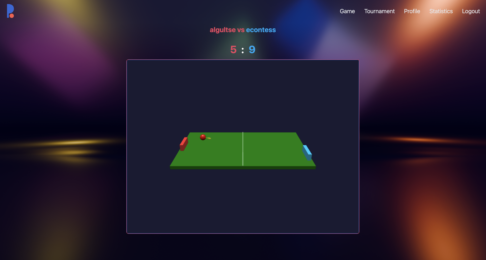
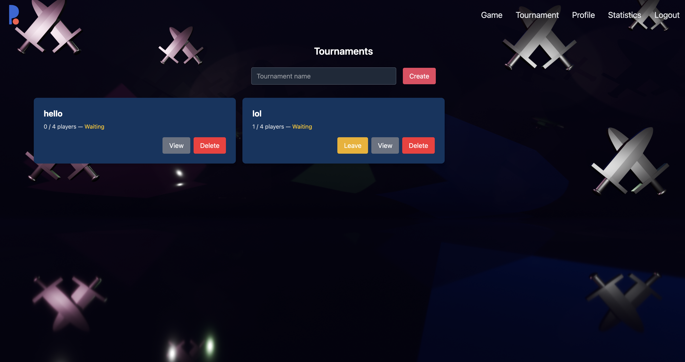
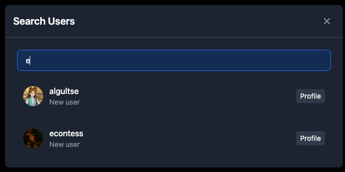

|           Grade          |                           |
|:------------------------:|:-------------------------:|
|  |  |
	

<br>

---

<details>
<summary>🇫🇷 FRENCH VERSION</summary>

<p align="center">
    <a href="./subject/ft_transcendence.en.subject.pdf">Projet</a> réalisé en mai 2025 à l'école 42, par une équipe de 3 personnes. 
</p>

## Préambule
Ce projet consiste à créer une plateforme de tournoi autour du `jeu Pong`, avec une architecture de `microservices`, `WebSocket`, et des fonctionnalités modernes telles que l’authentification à `deux facteurs`, le `matchmaking`, et l’`intelligence artificielle`.

## Fonctionnalités principales
- Jeu Pong en temps réel (`WebSocket`) avec deux joueurs distants (Remote Players)
- `Tournois` selon le système olympique
- `Matchmaking` instantané
- Authentification via `JWT` et `2FA`
- `Gestion des profils`, avatars, amis, statut en ligne
- `IA` comme adversaire (bot)
- DevOps: Architecture en `microservices` (Docker)
- Frontend : `TypeScript`
- Backend : `Node.js` avec `Fastify`
- DB: SQLite avec `Prisma`
- Game `statistics`

## 1. Lancement
```bash
git clone https://github.com/N0fish/ft_transcendence.git
cd ft_transcendence
```

## 2. Dans ./create_env_XX
Pour que le 2FA fonctionne dans Auth Service, vous devez ajouter :
```
EMAIL_ADDR="votre-email@gmail.com"
EMAIL_PASSWD="votre clé générée par Google"
```

### 3. Docker
```bash
./create_env_docker.sh
make fclean-node (not necessary)
make all
```
### 4. Accès
`make url`
```bash
https://<ip>:5173
```

### Ou en mode terminal (hors Docker)
```bash
./create_env.sh
make clean-node_module (not necessary)
make dev
```
</details>

---

<details>
<summary>🇬🇧 ENGLISH VERSION</summary>

<p align="center">
    Collaborative <a href="subject/ft_transcendence.en.subject.pdf">project</a> completed in May 2025 at 42 school.
</p>

## Preamble
This is a modern web platform based on the classic `Pong game` — reimagined as a real-time `multiplayer` `tournament` app with `microservices`, `matchmaking`, `WebSocket` gameplay, `2FA`, and `AI`.

## Key Features
- Real-time multiplayer Pong over `WebSocket`
- `Tournaments` according to the Olympic system
- `Matchmaking` queue
- `JWT` and `Two-Factor` Authentication
- `User profile` management, avatars, friend system
- `AI` Opponent (bot)
- DevOps: `Microservices` architecture (Docker)
- Frontend: `TypeScript`
- Backend: `Node.js` with `Fastify`
- DB: SQLite with `Prisma`
- Game `statistics`

## 1. Launch
```bash
git clone https://github.com/N0fish/ft_transcendence.git
cd ft_transcendence
```

## 2. In ./create_env_XX
For 2FA to work in the Auth Service, you must add:
```
EMAIL_ADDR="your-email@gmail.com"
EMAIL_PASSWD="your generated keys from google"
```

### 3. Docker
```bash
./create_env_docker.sh
make fclean-node (not necessary)
make all
```
### 4. Then
`make url`
```bash
https://<ip>:5173
```

### OR via terminal (without Docker)
```bash
./create_env.sh
make clean-node_module (not necessary)
make dev
```

</details>

---

<details>
<summary>🇷🇺 RUSSIAN VERSION</summary>

<p align="center">
    <a href="subject/ft_transcendence.en.subject.pdf">Проект</a>, выполненный в команде в мае 2025 года в школе 42.
</p>

## Преамбула
Это веб-приложение-турнир на основе `игры Pong` с архитектурой `микросервисов`, `WebSocket` и современными функциями. Вы можете играть против других игроков `по сети` в реальном времени, участвовать в `турнирах`, авторизоваться через `JWT + 2FA`, а также соревноваться против `ИИ`.

## Основные возможности
- Pong по `WebSocket`: игроки подключаются с разных устройств
- `Турниры` по олимпийской системе
- Поиск соперника (`matchmaking`)
- Авторизация и безопасность: `JWT`, `2FA`
- `Профиль игрока`: аватар, рейтинг, друзья, история матчей
- Противник-бот (`AI`)
- DevOps: `Микросервисная` архитектура (Docker)
- Фронтенд: `TypeScript` (без фреймворков)
- Бэкенд: `Node.js` с `Fastify`
- База данных: SQLite с использованием `Prisma`
- `Статистика` игры

## 1. Запуск программы
```bash
git clone https://github.com/N0fish/ft_transcendence.git
cd ft_transcendence
```

## 2. В ./create_env_XX
Auth Service для 2FA обязательно добавить:
```
EMAIL_ADDR="ваш-email@gmail.com"
EMAIL_PASSWD="ваш сгенерированный ключ с google"
```

# 3. Для Docker
```bash
./create_env_docker.sh
make fclean-node (не обязательно)
make all
```
# 4. Доступ к сайту
`make url`
```bash
https://<ip>:5173
```

# Или запуск через терминал (без Docker)
```bash
./create_env.sh
make clean-node_module (не обязательно)
make dev
```

</details>

---

<br>

## Modules
**Web**  
◦ Major module: Use a framework to build the backend.  
◦ Minor module: Use a framework or a toolkit to build the frontend.  
◦ Minor module: Use a database for the backend.

**User Management**  
◦ Major module: Standard user management, authentication, users across
tournaments.

**Gameplay and user experience**  
◦ Major module: Remote players

**AI-Algo**  
◦ Major module: Introduce an AI opponent.  
◦ Minor module: User and game stats dashboards

**Cybersecurity**  
◦ Major module: Implement Two-Factor Authentication (2FA) and JWT.

**Devops**  
◦ Major module: Designing the backend as microservices.

**Graphics**  
◦ Major module: Use advanced 3D techniques.

**Accessibility**  
◦ Minor module: Expanding browser compatibility.

**Server-Side Pong**  
◦ Major module: Replace basic Pong with server-side Pong and implement an
API.

---

## Authors
Developer, Frontend, DevOps, microservices, game logic, tournament system, game statistics, auth service, user profiles, 2FA & JWT, etc.  
Made with 🤍 by:
- [algultse](https://github.com/N0fish)
- [urosby](https://github.com/KarinaLogvina)
- [econtess](https://github.com/eddard-contessa)


|                          |                            |
|:------------------------:|:--------------------------:|
|   |  |
|  |   |

> This project was developed as a team collaboration at Ecole 42 in May 2025.